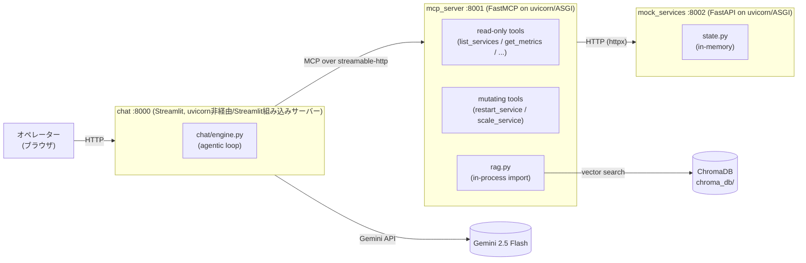
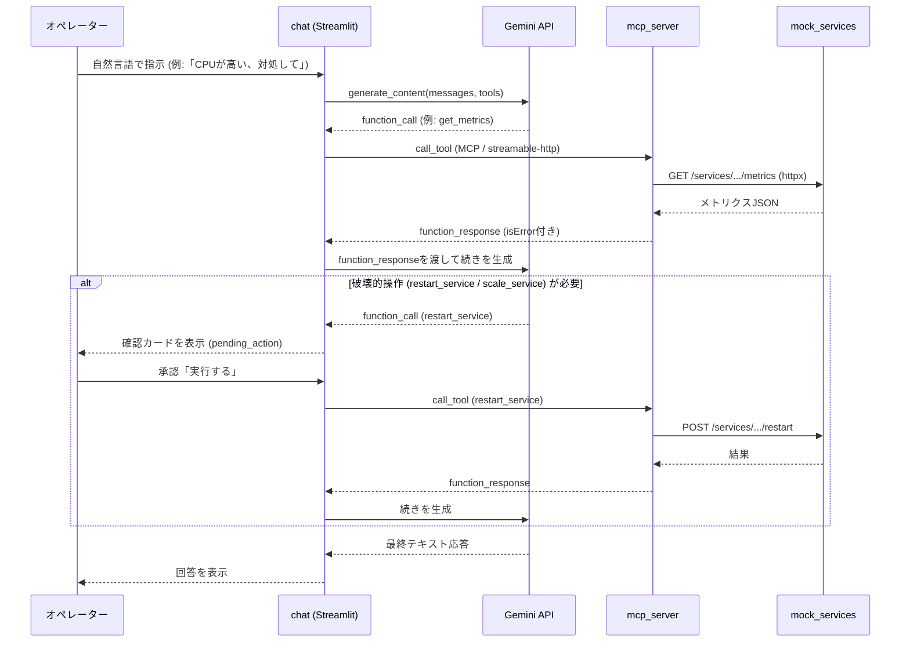

# AI Ops Agent

マイクロサービス基盤の運用をチャットで行うための、ポートフォリオ用AIエージェントです。オペレーターが日本語でLLMエージェントと対話し、シミュレートされた5つのマイクロサービス（`api-gateway` / `payment-service` / `order-service` / `user-service` / `notification-service`）を監視・調査・操作します。エージェントはMCP (Model Context Protocol) 経由でログやメトリクスの確認、スケーリングなどの復旧作業を行います。

## 技術スタック

- **言語**: Python
- **LLM**: Gemini 2.5 Flash（`google-genai`）
- **エージェント⇔ツール連携**: MCP（`mcp` SDK, streamable-http transport）
- **Web API**: FastAPI（`mock_services`）/ FastMCP（`mcp_server`）on uvicorn（ASGI）
- **UI**: Streamlit
- **RAG**: LlamaIndex + ChromaDB（ベクトルストア）+ sentence-transformers（`all-MiniLM-L6-v2`）
- **HTTPクライアント**: httpx
- **インフラ**: Docker / docker-compose

## 特徴

- **チャットで運用**: 「全サービスの状況を確認して」「payment-serviceのCPUが高い、対処して」のような自然言語の指示で、メトリクス確認・ログ調査・アラート確認・ランブック検索・サービス操作までを一気通貫でこなします。
- **Human-in-the-loop**: 再起動・スケール変更などの破壊的操作は、エージェントが提案した内容（対象サービス・変更内容・理由）を確認カードとして提示し、オペレーターが承認するまで実行されません。
- **RAGによるランブック参照**: `runbooks/`配下のMarkdownドキュメント（高CPU・高メモリ・レイテンシ急増・サービス再起動時の対応手順）をベクトル検索し、エージェントが対応方針を判断する材料として利用します。
- **障害シナリオ入り**: 起動直後から`payment-service`と`notification-service`が意図的に「degraded」状態になっており、エージェントが原因を調査して対処する、というシナリオをすぐに試せます。

## アーキテクチャ

3つのサービスで構成されています（`docker-compose.yml`で連携）。

- **`mock_services`**（FastAPI, port 8002）: 実際の運用対象に見立てたモックバックエンド。5サービス分のメトリクス・ログ・アラートをインメモリで保持し、再起動・スケール変更のリクエストを受け付けます。
- **`mcp_server`**（FastMCP, port 8001）: 運用操作をMCPツールとして公開するサーバー。読み取り系ツール（`list_services` / `get_metrics` / `get_health` / `get_logs` / `get_alerts`）と`mock_services`へのHTTP経由の操作系ツール（`restart_service` / `scale_service`）、そしてChromaDBを使ったランブック検索ツール（`search_runbook`）を提供します。
- **`chat`**（Streamlit, port 8000）: エージェントのループとUI本体。Gemini 2.5 FlashにMCPツールのスキーマを渡してエージェンティックループを回し、破壊的操作が要求された場合はUIに確認を委ねます。



`mcp_server`と`mock_services`はどちらもASGIアプリ(FastAPI/FastMCP)をuvicornでホストしています。`chat`↔`mcp_server`間はMCPの`streamable-http`トランスポート、`mcp_server`↔`mock_services`間は素のHTTP(`httpx`)です。`search_runbook`だけはHTTPを介さず、`mcp_server`プロセス内でChromaDBを直接検索します（[ADR-0003](docs/adr/0003-runbook-search-in-process.md)）。uvicorn・ASGI・FastAPI/FastMCPの役割分担については[docs/asgi-and-uvicorn.md](docs/asgi-and-uvicorn.md)にまとめています。

### 処理の流れ



上記の構成に至った設計判断（Dockerイメージの分割、Human-in-the-loop確認、ランブック検索の実装方針など）は
[docs/adr/](docs/adr/)に記録しています。

## セットアップ

`.env.example`を`.env`にコピーし、`GEMINI_API_KEY`を設定してください（[Google AI Studio](https://aistudio.google.com/app/apikey)で取得できます）。

### Dockerで起動する場合

```bash
docker-compose up --build
```

`mcp_server`は起動のたびにランブックの索引を再構築するため、事前準備は不要です。起動後、ブラウザで `http://localhost:8000` を開きます。

### ローカルで起動する場合

別々のターミナルで、以下の順に起動します。

```bash
pip install -r requirements-light.txt -r requirements-rag.txt

# ランブックの索引を初回のみ構築
python -m scripts.index_runbooks

uvicorn mock_services.app:app --host 0.0.0.0 --port 8002
uvicorn mcp_server.server:mcp.streamable_http_app --factory --host 0.0.0.0 --port 8001
python -m streamlit run chat/app.py --server.port 8000
```

## 使い方の例

チャット欄に日本語で指示を入力するだけです。

- 「全サービスの状況を確認して」
- 「payment-serviceのCPUが高い、対処して」
- 「アラートを確認して、対応が必要なものがあれば教えて」

再起動・スケール変更が提案されると、対象サービスと理由を示す確認カードが表示され、「実行する」を押すまで操作は行われません。

<!--
  ここに実際の操作画面のスクリーンショットを貼ってください。目安として以下のような場面を想定しています。

  1. トップ画面（チャット入力前の初期状態）
  2. 通常の調査応答の例（例:「全サービスの状況を確認して」に対する回答）
  3. 異常検知〜対応提案の一連の流れ（例: payment-serviceのCPU高騰をエージェントが調査し、再起動 or スケール変更を提案する場面）
  4. 破壊的操作の確認ダイアログ（再起動 or スケール変更の確認カードが表示された状態）
  5. 確認後、操作が反映されて正常化したことを報告する場面
-->

## 補足

- 状態はすべてインメモリで、サービス再起動時にリセットされます。
- テストスイートやリンターは現状導入していません。
