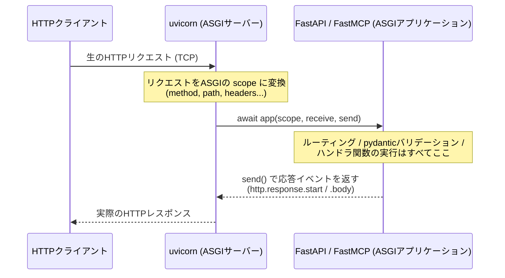

# ASGI / uvicorn / FastAPI・FastMCPの関係

`mock_services`・`mcp_server`・`chat_api`はいずれも`uvicorn ... --host 0.0.0.0 --port ...`で起動する。
「HTTPを受け取っているのはuvicornなのに、実際に処理しているのはFastAPI/FastMCPのルーティング」
という2段構造がやや分かりにくいので、ここに整理しておく。ADR-0001（Dockerイメージの分割）にも
関連する一般的な技術知識のため、意思決定の記録であるADRとは分けてここにまとめる。

## 各レイヤーの役割

- **uvicorn（ASGIサーバー）**: TCP接続を受けてHTTPをパースし、ASGIが定めた共通形式
  （`scope`/`receive`/`send`）に変換して呼び出すだけの層。「`/services/payment-service/metrics`に
  何の処理を割り当てるか」はuvicornは一切知らない。**「ASGIアプリケーションと呼べる形なら
  何でも動かせる」という汎用的な土管**に過ぎない。
- **ASGI (Asynchronous Server Gateway Interface)**: PythonのWebサーバーとWebアプリケーション
  フレームワークの間の共通インターフェース仕様。WSGI（同期・1リクエスト=1レスポンス限定）の
  非同期版で、`async def app(scope, receive, send)`という形のcallableであれば、どんな
  フレームワークで書かれていてもASGIサーバーから呼び出せる。
- **FastAPI（常にASGIアプリケーション）**: `FastAPI()`のインスタンス自体がStarlette
  （ASGIツールキット）上に構築されたASGIアプリケーション（＝`scope`/`receive`/`send`を
  受け取れるcallable）そのもの。ルーティング・リクエストのバリデーション・ハンドラ関数の
  呼び出し・レスポンス生成はこの層の仕事。
- **FastMCP（トランスポートを選べるMCPサーバー）**: `FastMCP`自体はASGIアプリではなく、
  `stdio`（標準入出力、HTTP/ASGIとは無関係。`FastMCP.run()`のデフォルト）・`sse`・
  `streamable-http`という複数のトランスポートに対応する汎用のMCPサーバー実装。ASGIアプリに
  なるのは`streamable_http_app()`（または`sse_app()`）を呼んでStarlette製のASGIアプリを
  組み立てた場合のみ。このリポジトリは`streamable-http`トランスポートを使っているため
  ASGI/uvicornに乗せているが、仮に`stdio`トランスポートで動かす場合はuvicornもASGIも
  一切関与しない。

## このリポジトリでの具体例

- **`mock_services`**: `uvicorn mock_services.app:app --host 0.0.0.0 --port 8002`
  `app`は`mock_services/app.py`で定義されたFastAPIインスタンスそのもの＝ASGIアプリ本体。
  uvicornはこれをimportしてそのまま呼び出す。
- **`mcp_server`**: `uvicorn mcp_server.server:mcp.streamable_http_app --factory --host 0.0.0.0 --port 8001`
  `mcp.streamable_http_app`はASGIアプリの**インスタンスではなく、それを組み立てて返す関数**
  （factory）。`--factory`フラグは「これはASGIアプリそのものではなく、呼び出せばASGIアプリを
  返す関数だ」とuvicornに伝えるためのもの。詳細は[ADR-0001](adr/0001-service-split-and-docker-images.md)。
- **`chat_api`**: `uvicorn chat.api:app --host 0.0.0.0 --port 8003`
  `app`は`chat/api.py`で定義されたFastAPIインスタンス＝ASGIアプリ本体。`mock_services`と
  同じパターンで、`--factory`は不要。
- **`frontend`**: `node server.js`（Next.jsのstandalone出力）
  Next.jsはASGI/uvicornを使わず、Node.js上で自身のHTTPサーバーを内蔵している。そのため
  `frontend`だけはこの図の対象外で、docker-composeのcommandにもuvicornは登場しない。

## なぜASGI（非同期）が必要か

WSGI（Flask/Django classicなど）は同期・1リクエスト=1レスポンスの世界しか扱えず、
WebSocketやServer-Sent Events（SSE）のような長時間持続する接続を表現できない。
ASGIは`http.request`/`http.response.start`/`http.response.body`のような複数の
メッセージイベントをやり取りできる形に一般化されており、WebSocket・SSE・非同期I/Oに対応する。

`mcp_server`が使うMCPの`streamable-http`トランスポートはSSEによるストリーミングを含むため、
この非同期な土台（ASGI）が前提になっている。`mcp_server`のツール関数が`httpx`で
`mock_services`を非同期に呼び出せているのも同じ理由による。
